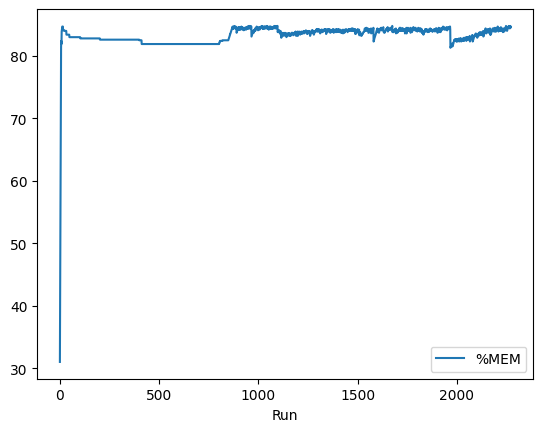
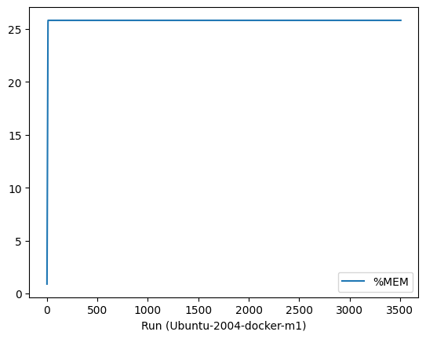
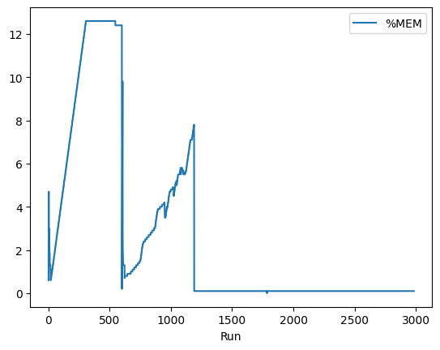
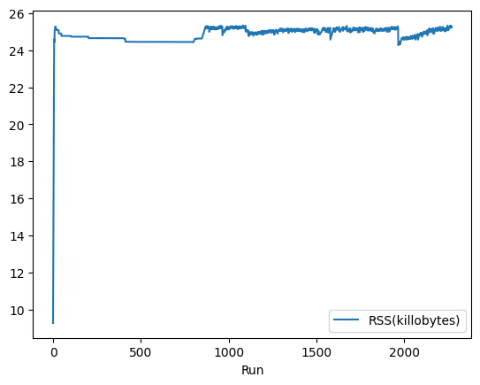
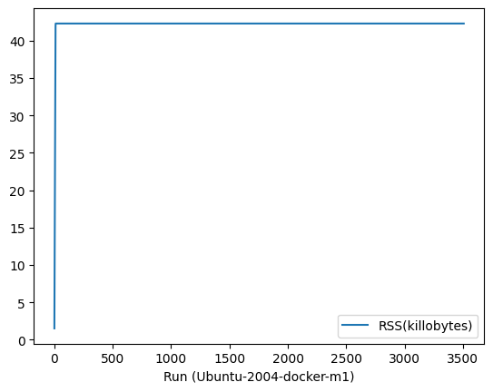
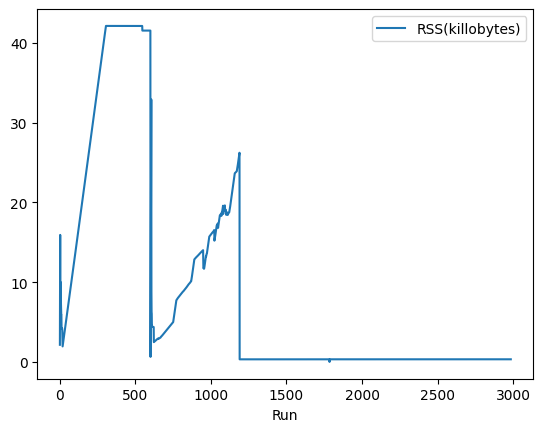

# Memory Consumption of WasmEdge Runtime

Inspired by [Potential Memory Leak Issue](https://github.com/WasmEdge/WasmEdge/issues/1805), this repository is used to measure the memory consumption of WasmEdge runtime.

## How to use

- Build `hello` wasm library

    ```bash
    cargo build -p hello --target wasm32-wasi --release
    ```

    > If the `wasm32-wasi` target is not installed, please install it by `rustup target add wasm32-wasi`.

- Run `hello` wasm library

    ```bash
    cargo run -p mem-test
    ```

- Run `show_mem.sh` to collect memory usage data

    ```bash
    ./show_mem.sh
    ```

- Analyze and visualize the statistics

    Open the `render.ipynb` notebook and run the scripts in the file to see the results.

## Test Setup

The data and diagrams shown below are generated in the following test environments:

- OS and Architecture
  - Ubuntu 20.04 (WSL2, x86_64)
  - Ubuntu 20.04 (Docker, Apple M1)
  - macOS 13.2.1 (Apple M1)

- WasmEdge-0.12.0-alpha.2-38-gdad018af

- WasmEdge Rust SDK
  - wasmedge-sdk-0.8.0-rc
  - wasmedge-sys-0.13.0-rc

The metrics used in the test are as follows:

- Memory Consumption Percentage (MCP)
- Resident Set Size (RSS)
  
## Results

- Memory Consumption Percentage (MCP)

    <firgure class="third">
        
        
        
    </firgure>

- Resident Set Size (RSS)

    <firgure class="third">
        
        
        
    </firgure>
