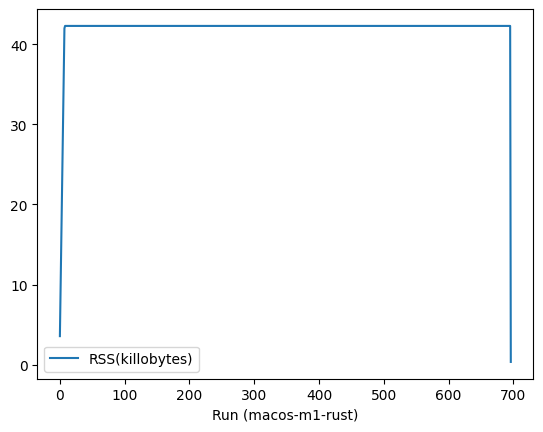
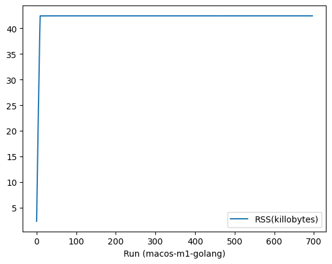

# Memory Consumption Test of WasmEdge Runtime

Inspired by [Issue 1805: Potential Memory Leak Issue](https://github.com/WasmEdge/WasmEdge/issues/1805), this repository is to measure the memory consumption of WasmEdge runtime with Rust and Golang SDK.

## Test Setup

The test is performed in the following software (and hardware) environments:

- OS and Architecture
  - Ubuntu 22.04 (WSL2, x86_64)
  - Ubuntu 20.04 (Docker v4.17.0, Apple M1)
  - Fedora 37 (Docker v4.17.0, Apple M1)
  - macOS 13.2.1 (Apple M1)

- WasmEdge-0.12.0-alpha.2-38-gdad018af

- WasmEdge Rust SDK (wasmedge-sdk-0.8.0-rc)

- WasmEdge Go SDK v0.12.0-alpha.2

- Test Code
  - Rust version: ./mem-test/src/main.rs
  - Golang version: ./hello-go/test.go

The metrics used in the test are as follows:

- Memory Consumption Percentage (MCP)
- Resident Set Size (RSS)
  
## Results

- Memory Consumption Percentage (MCP)

  - Test with Rust SDK
    Ubuntu-22.04 on WSL2 + x86 | Ubuntu-20.04 on Docker + Apple M1
    :-------------------------:|:-------------------------:
      |  
    
    Fedora 37 on Docker + Apple M1  |  macOS 13.2.1 + Apple M1
    :------------------------------:|:-------------------------:
      |  

  - Test with Go SDK
    Ubuntu-22.04 on WSL2 + x86 | Ubuntu-20.04 on Docker + Apple M1
    :-------------------------:|:-------------------------:
      |  
    
    Fedora 37 on Docker + Apple M1  |  macOS 13.2.1 + Apple M1
    :------------------------------:|:-------------------------:
      |  

- Resident Set Size (RSS)

  - Test with Rust SDK
    Ubuntu-22.04 on WSL2 + x86 | Ubuntu-20.04 on Docker + Apple M1
    :-------------------------:|:-------------------------:
      |  
    
    Fedora 37 on Docker + Apple M1  |  macOS 13.2.1 + Apple M1
    :------------------------------:|:-------------------------:
      |  
    
  - Test with Go SDK
    Ubuntu-22.04 on WSL2 + x86 | Ubuntu-20.04 on Docker + Apple M1
    :-------------------------:|:-------------------------:
      |  
    
    Fedora 37 on Docker + Apple M1  |  macOS 13.2.1 + Apple M1
    :------------------------------:|:-------------------------:
      |  
