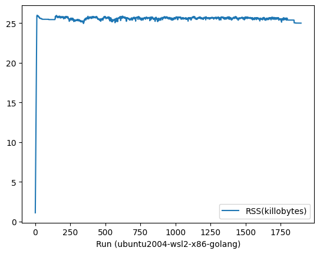

# Memory Consumption Test of WasmEdge Runtime

Inspired by [Issue 1805: Potential Memory Leak Issue](https://github.com/WasmEdge/WasmEdge/issues/1805), this repository is to measure the memory consumption of WasmEdge runtime with Rust and Golang SDK.

## Test Setup

The test is performed in the following software (and hardware) environments:

- OS and Architecture
  - Ubuntu 22.04 (WSL2, x86_64)
  - Ubuntu 20.04 (Docker v4.17.0, Apple M1)
  - Fedora 37 (Docker v4.17.0, Apple M1)
  - macOS 13.2.1 (Apple M1)

- WasmEdge-0.12.0-alpha.2-38-gdad018af

- WasmEdge Rust SDK (wasmedge-sdk-0.8.0-rc)

- WasmEdge Go SDK v0.12.0-alpha.2

- Test Code
  - What it does: Run a host functon continuously for 3600 + 1800 seconds, then sleep 300 seconds, and then end the test.
  - Rust version: ./mem-test/src/main.rs
  - Golang version: ./hello-go/test.go

The metrics used in the test are as follows:

- Memory Consumption Percentage (MCP)
- Resident Set Size (RSS)
  
## Results

**Observations**:

- As the diagrams below shows, both MCP and RSS of the Rust SDK on `macOS + Apple M1` go down in the final phase, while the others do not present the same trend.

- All diagrams of the Go SDK do not present the decline of MCP and RSS in the final phase, even if on `macOS + Apple M1`. The reason might be that the `ps` command cannot get the correct information of the memory consumption while the garbage collector of Golang starts working.

- The tests with both Rust and Go SDK all climb up to the peak sharply at the begining, and then keep the plateau to the end. There is no obvious trend of the memory consumption keeping rising during the process of calling the `hello` host function periodically.

### Diagrams of Memory Consumption Percentage (MCP)

  - Diagrams of the tests with Rust SDK

    Only the diagram of the test on `macOS 13.2.1 + Apple M1` shows the memory going down in the final phase (the sleeping phase in test code), while the others seem not to do the cleanup job.

    Ubuntu-22.04 on WSL2 + x86 | Ubuntu-20.04 on Docker + Apple M1
    :-------------------------:|:-------------------------:
      |  
    
    Fedora 37 on Docker + Apple M1  |  macOS 13.2.1 + Apple M1
    :------------------------------:|:-------------------------:
      |  

  - Diagrams of the tests with Golang SDK

    Ubuntu-22.04 on WSL2 + x86 | Ubuntu-20.04 on Docker + Apple M1
    :-------------------------:|:-------------------------:
      |  
    
    Fedora 37 on Docker + Apple M1  |  macOS 13.2.1 + Apple M1
    :------------------------------:|:-------------------------:
      |  

### Diagrams of Resident Set Size (RSS)

  - Diagrams of the tests with Rust SDK
  
    Ubuntu-22.04 on WSL2 + x86 | Ubuntu-20.04 on Docker + Apple M1
    :-------------------------:|:-------------------------:
      |  
    
    Fedora 37 on Docker + Apple M1  |  macOS 13.2.1 + Apple M1
    :------------------------------:|:-------------------------:
      |  
    
  - Diagrams of the tests with Go SDK

    Ubuntu-22.04 on WSL2 + x86 | Ubuntu-20.04 on Docker + Apple M1
    :-------------------------:|:-------------------------:
      |  
    
    Fedora 37 on Docker + Apple M1  |  macOS 13.2.1 + Apple M1
    :------------------------------:|:-------------------------:
      |  
